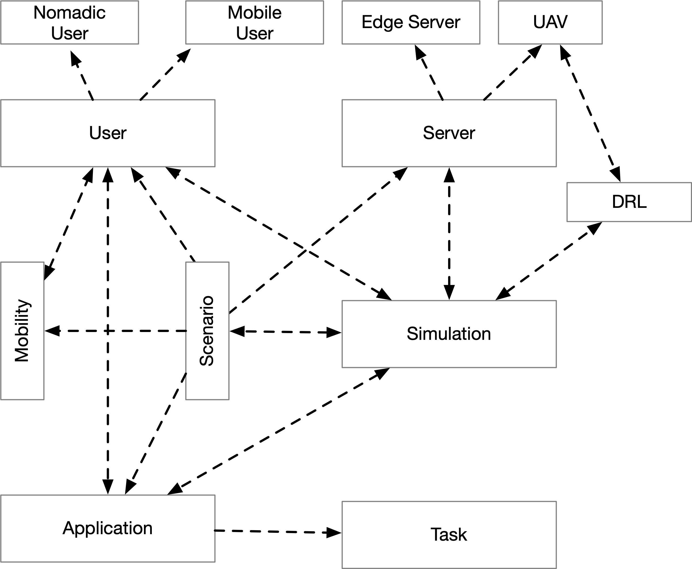
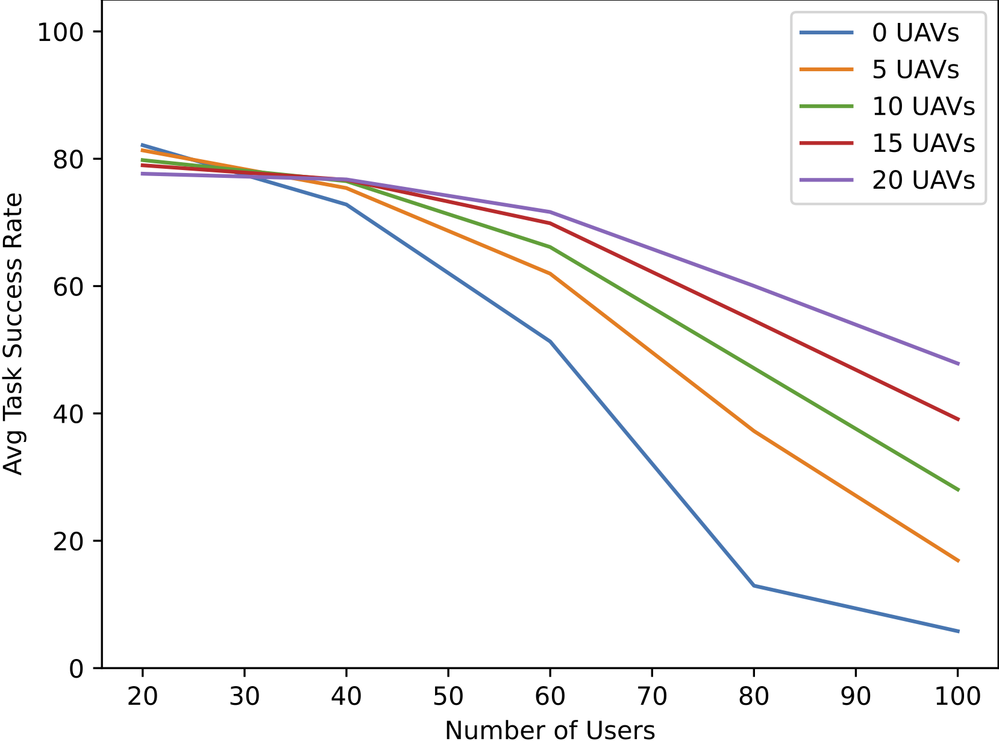
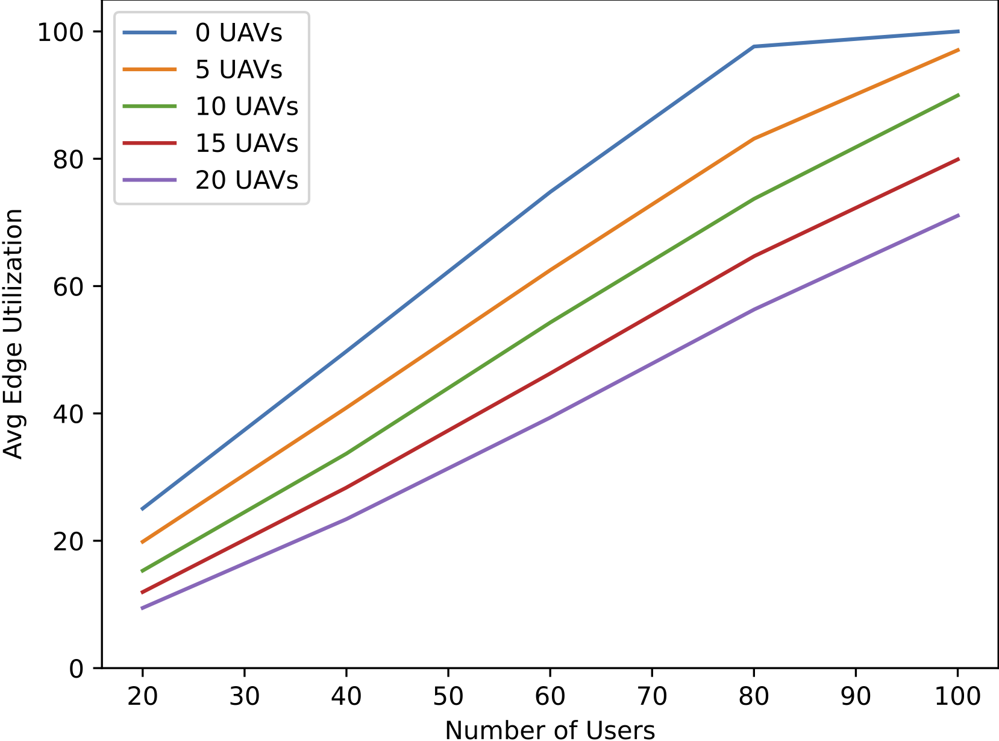
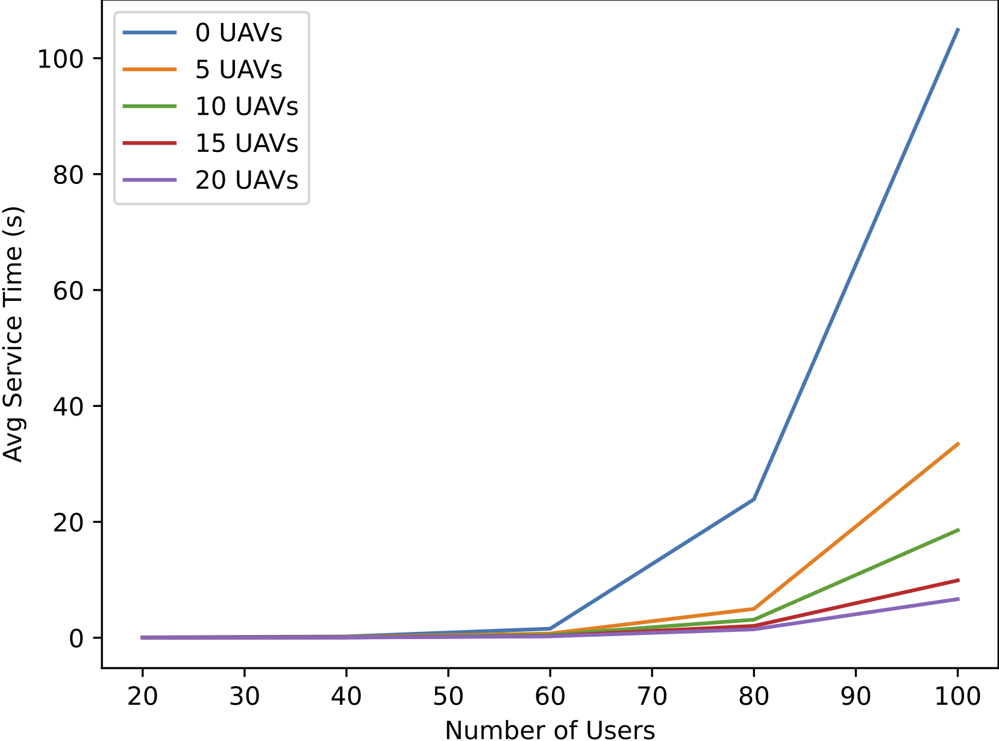
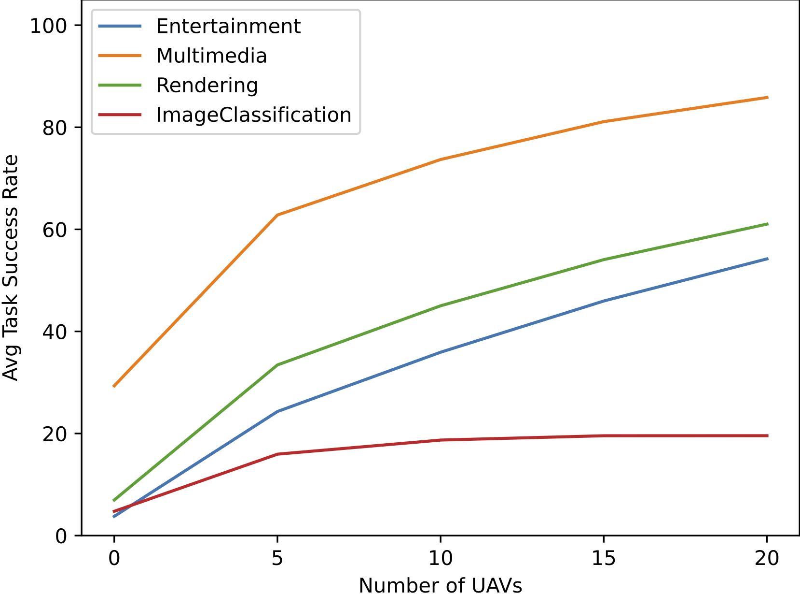
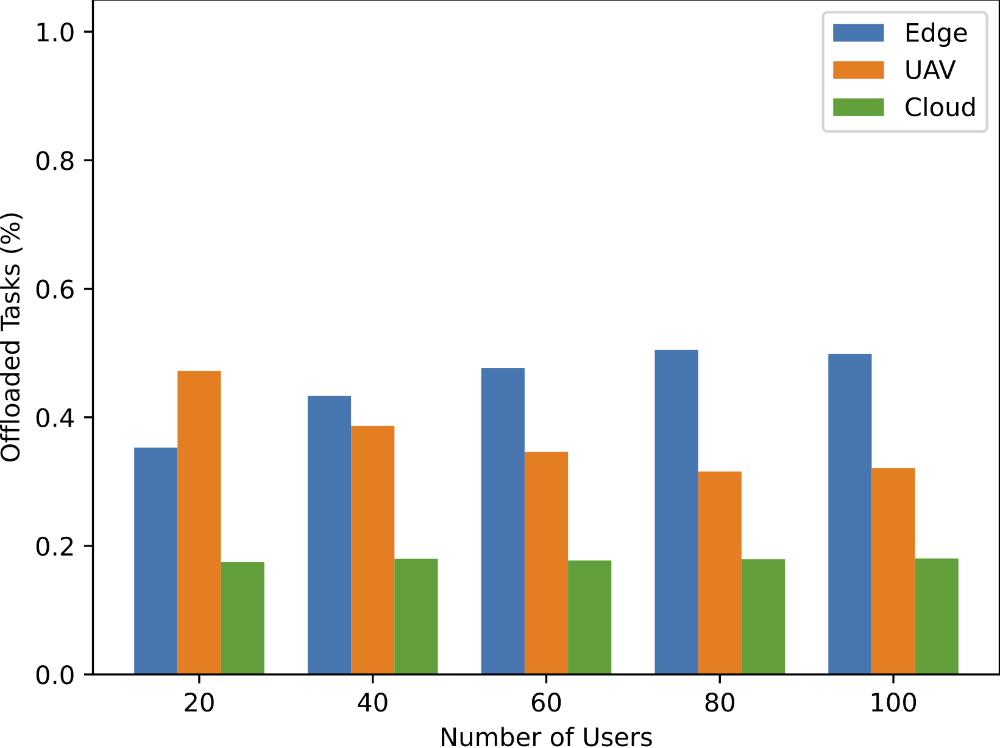

# AirCompSim: A discrete event simulator for air computing

AirCompSim, which ensures a discrete event simulation environment to conduct complex air computing experiments based on 
varied scenarios. AirCompSim achieves that by providing a modular structure. Therefore, it is straightforward to alter 
the corresponding parameters, add new scenarios including dynamic events such as server failure, and create new flying 
policies for UAVs. Moreover, it also provides an event mechanism for deep reinforcement learning (DRL) so that smart 
and sophisticated UAV policies such as where to fly and when to fly can be investigated. Furthermore, since the 
essential results are logged and stored, it provides an easy mechanism to plot the related results after the 
experiments. If you want to use this implementation in your research, please cite 
our paper [[1]](https://arxiv.org/pdf/2409.00689).

## Modules

### Simulation (main.py)

This is the module where the simulation starts. It is responsible for handling the events in a simulation via the event 
queue and creating the corresponding user types, user mobility, and UAV policies. Moreover, it provides a detailed 
logging mechanism including the events, task offloading, UAV flying, and task processing so that it allows a detailed 
debugging option for the researchers. Furthermore, it saves the results of the repeated simulations as a *csv* 
file(s) therefore after a detailed experiment it is straightforward to process the results using various libraries such as
*pandas*. *Plots.py* can be directly used after the completion of a simulation.

### Server

The server module defines a generic class for the entities having server features. To this end, this module is used as 
a parent class for edge servers, UAVs, and the cloud server. Note that in the current version of AirCompSim , 
UAVs are the only flying vehicles in the simulator. However, it is easy to add additional flying 
servers with different altitudes based on the server module. This module also provides the utilization, processing 
delay for the given tasks, and earliest idle time based on the queueing. A server module-based entity has a 
computational capacity to serve the offloaded tasks based on the *M/M/1* queueing model. 

#### Edge Server

In our simulator, edge servers are located in LANs on the ground. They have a coverage radius in which users can 
connect to them to offload their tasks. Their capacity and location are fixed throughout an experiment. Even though 
the corresponding capacity can be set by researchers in the simulation module, in the default settings of AirCompSim, 
the capacity of an edge server is less than that of a cloud server and higher than that of a UAV.

#### UAV

We consider UAVs as flying edge servers with less capacity in our simulator. Therefore, various flying policies can be 
applied in AirCompSim in order to observe the effects of different proposals on task success rate, utilization, and 
service delay. In the default settings of AirCompSim, UAVs fly to the areas that have already been covered by an edge 
server in order to enhance the corresponding capacity.

#### Cloud Server

A cloud server is the most powerful entity in terms of computational capacity in an air computing environment. However, 
since it is accessed through the WAN, it is prone to higher network delay than LAN and MAN. Hence, it is critical to 
select a cloud server for task offloading when the corresponding maximum tolerable delay is high. In the default 
settings of AirCompSim, a cloud server is selected by a user if there is neither an edge server nor a UAV to connect.

### User

The user module supports different user types, including mobile users, nomadic users, and users in the air. In the 
current implementation of AirCompSim there are mobile users and nomadic users. The main difference between them is 
their mobility pattern. A user can connect to multiple servers simultaneously if it is in the coverage of them. In 
the default mode of AirCompSim, if a user is connected to multiple servers, such as a UAV and an edge server, the task 
is offloaded to one of them, which has a lower queueing delay. Here, we assume that users are informed by their 
connected servers in a separate channel. Note that this default behavior can be changed by a researcher to seek 
efficient offloading decisions.

### Application

The mobility module provides user mobility and also heuristic UAV flying policies. Based on the research goals, a user 
mobility module or a flying policy for UAVs can be added to the simulator. By default, a random waypoint model runs 
for the mobility of each user in the environment. On the other hand, UAVs fly between areas where edge servers are 
deployed in the center based on capacity calculations. A capacity calculation for areas is carried out by including 
the number of user and their application profiles, and also the total capacity of edge servers. Afterwards, the 
required number of additional capacity and therefore the number of UAVs are computed. Finally, UAVs are deployed 
in the corresponding areas. Note that if an area has a higher need for UAVs, that area has a priority for UAV 
deployment considering a constraint in the number of UAVs.

### Scenario

The scenario module includes the experimental setup which is essential for the performance evaluation. To this end, the 
number of users, edge servers, UAVs, the location of all kinds of servers, the user mobility model, and also the 
corresponding capacities of servers are first defined in this module. Moreover, if the experiment includes dynamic 
updates such as a server failure or sudden increase in capacity demand, those can also be defined in this module.

### DRL

The DRL module consists of the implementation of value-based and policy-based DRL algorithms in addition to the event 
mechanism which provides the corresponding state information along with the rewards. The implementation of DRL 
algorithms is supported by PyTorch-based neural networks. Note that since DRL-based studies require more sophisticated 
settings, AirCompSim only provides the skeleton that can be adapted to the related scenarios by researchers.

## Example Output for AirCompSim

## Publications
**[1]** B. Yamansavascilar, A. Ozgovde, and C. Ersoy, "[AirCompSim: A Discrete Event Simulator for Air Computing](https://arxiv.org/pdf/2409.00689)," *arXiv preprint*, arXiv: 2409.00689, 2024.
