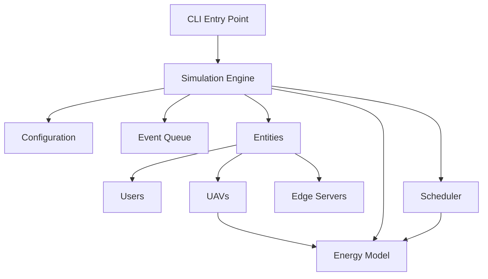
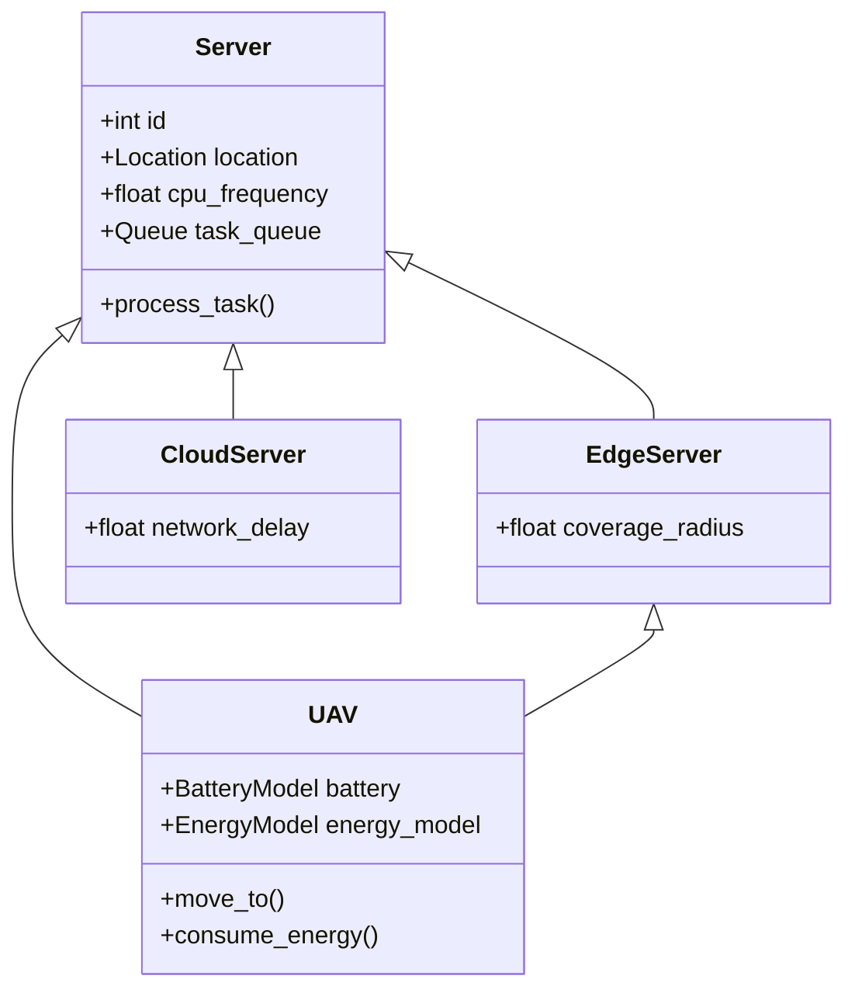
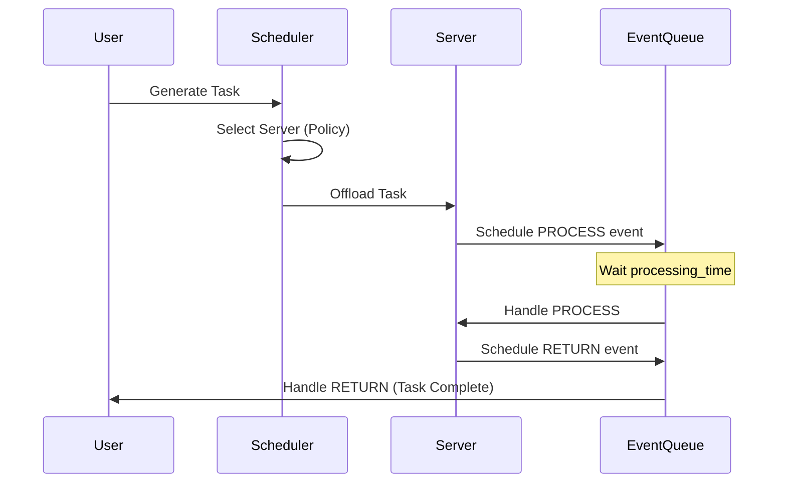

# AirCompSim - Energy-Efficient Air Computing Simulator

<p align="center">
  <strong>A modular discrete event simulator for energy-aware task offloading in UAV-assisted edge computing environments</strong>
</p>

<p align="center">
  <a href="#features">Features</a> •
  <a href="#installation">Installation</a> •
  <a href="#quick-start">Quick Start</a> •
  <a href="#architecture">Architecture</a> •
  <a href="#usage">Usage</a> 
</p>

---

## Features

- **Multi-tier Computing**: Simulate UAVs, edge servers, and cloud infrastructure
- **Energy-Aware Scheduling**: Task offloading with energy efficiency optimization
- **UAV Battery Modeling**: Physics-based energy consumption for flight, hover, and computation
- **DRL Integration**: Deep Q-Network (DQN), Double DQN, and Actor-Critic agents
- **Flexible Mobility**: Random waypoint and custom mobility models
- **Comprehensive Metrics**: QoS, latency, energy consumption, and utilization tracking

## Installation

### Prerequisites

- Python 3.9+
- pip or conda

### Install from Source

```bash
# Clone the repository
git clone https://github.com/tuluyhansozen/EnergyEfficientAirComputing.git
cd EnergyEfficientAirComputing

# Install in development mode
pip install -e ".[dev]"
```

### Verify Installation

```bash
# Run tests
pytest tests/ -v

# Check package
python -c "from aircompsim import Location; print('✓ Package installed successfully')"
```

## Quick Start

### Basic Simulation

```python
from aircompsim.entities import Location, EdgeServer, UAV
from aircompsim.energy import EnergyModel, BatteryModel

# Create an edge server
edge = EdgeServer(
    capacity=1000,
    location=Location(100, 100, 0),
    radius=100,
    power_consumption=100
)

# Create a UAV with energy tracking
uav = UAV(
    capacity=500,
    location=Location(200, 200, 200),
    radius=100,
    power_consumption=50,
    battery_level=100
)

# Calculate flight energy
energy_model = EnergyModel()
flight_energy = energy_model.compute_flight_energy(
    distance=100,  # meters
    velocity=10    # m/s
)
print(f"Flight energy: {flight_energy:.2f} J")
```

### Configuration-Based Simulation

```python
from aircompsim.config import SimulationConfig, load_config

# Load from YAML
config_data = load_config("config/simulation.yaml")
config = SimulationConfig.from_dict(config_data)

# Or use defaults
config = SimulationConfig(
    time_limit=1000,
    user_count=20,
)
config.uav.count = 5
config.energy.use_physics_model = True
```

### Energy-Aware Scheduling

```python
from aircompsim.energy import EnergyAwareScheduler, SchedulingStrategy

scheduler = EnergyAwareScheduler(
    strategy=SchedulingStrategy.BALANCED,
    max_queue_length=100
)

# Select best server for a task
decision = scheduler.select_server(
    task=my_task,
    available_servers=[edge1, edge2, uav1],
    current_time=simulation_time
)

print(f"Selected: {decision.server_id}")
print(f"Expected latency: {decision.expected_latency:.3f}s")
print(f"Expected energy: {decision.expected_energy:.2f}J")
```

## Architecture

### High-Level Architecture

The project is structured as a modular Python package `aircompsim`.



#### Core Modules

| Module | Responsibility | Key Classes |
|--------|----------------|-------------|
| **`aircompsim.core`** | Simulation engine and event loop | `Simulation`, `Event`, `EventQueue` |
| **`aircompsim.entities`** | Physical entities in the system | `User`, `UAV`, `EdgeServer`, `Task` |
| **`aircompsim.energy`** | Energy consumption modeling | `EnergyModel`, `BatteryModel`, `ChargingStation` |
| **`aircompsim.drl`** | Reinforcement learning agents | `DQNAgent`, `ActorCriticAgent`, `ReplayBuffer` |
| **`aircompsim.config`** | Configuration management | `SimulationConfig`, `load_config` |

### Core Components

#### Simulation Engine (`core/simulation.py`)
The `Simulation` class orchestrates the entire lifecycle. It uses a **Discrete Event Simulation (DES)** approach.
- **Initialization**: Sets up users, servers, and UAVs based on config.
- **Event Loop**: Processes events from the priority queue ordered by time.
- **Event Handlers**:
    - `OFFLOAD`: Task generation and server selection.
    - `PROCESS`: Task processing on a server.
    - `RETURNED`: Task completion and result delivery.
    - `UAV_MOVE`: UAV movement updates.
    - `STATE_UPDATE`: Periodic DRL state observation.

#### Event System (`core/event.py`)
Events drive the simulation.
```python
@dataclass
class Event:
    priority: float      # Processing order
    sim_time: float      # Simulation timestamp
    event_type: EventType
    task: Optional[Task]
    target_id: Optional[int]
```

#### Energy Model (`energy/models.py`)
Calculates energy consumption for all operations.
- **Flight Energy**: Based on aerodynamics (lift, drag, velocity).
- **Compute Energy**: Based on CPU cycles and frequency (E = κf³t).
- **Communication Energy**: Based on transmission power and bandwidth.

#### Scheduler (`energy/scheduler.py`)
Decides where to offload tasks.
- **Strategies**:
    - `ENERGY_FIRST`: Minimize total energy (UAV + transmission).
    - `LATENCY_FIRST`: Minimize completion time.
    - `BALANCED`: Weighted sum of energy and latency cost.
    - `DRL_BASED`: Uses trained agent policy.

### Entity Hierarchy

The server hierarchy allows polymorphic handling of compute resources.



### DRL Integration

The system supports **Deep Reinforcement Learning** for dynamic decision making, particularly for UAV positioning and task offloading.

- **State Space**: Device locations, queue lengths, battery levels.
- **Action Space**:
    - Discrete: Select server index.
    - Continuous: UAV velocity vector (dx, dy).
- **Reward Function**: Combination of task success, latency reduction, and energy savings.

### Flow Diagrams

#### Task Lifecycle



### Configuration Structure

Configuration is managed via YAML/JSON files and loaded into strong-typed dataclasses.

```python
@dataclass
class SimulationConfig:
    time_limit: int
    user_count: int
    uav_config: UAVConfig
    edge_config: EdgeConfig
    energy_config: EnergyConfig
```

This ensures type safety and easy experimentation with different parameters.

## Usage

### Running a Simulation

```bash
# With default configuration
python -m aircompsim

# With custom config
python -m aircompsim --config config/my_scenario.yaml

# With DRL training
python -m aircompsim --drl --episodes 500
```

### Configuration Options

Create a `simulation.yaml` file:

```yaml
simulation:
  time_limit: 1000
  warmup_period: 100
  seed: 42

user_count: 20

uav:
  count: 5
  capacity: 500
  initial_battery: 100

energy:
  use_physics_model: true
  low_battery_threshold: 30

drl:
  enabled: true
  algorithm: DDQN
  episodes: 500
```

## Energy Models

### UAV Energy Consumption

The simulator models UAV energy consumption across multiple modes:

| Mode | Formula | Parameters |
|------|---------|------------|
| Flight | E = α × d × v² | α=0.05, distance, velocity |
| Hover | E = β × t | β=3.0 W, duration |
| Compute | E = γ × t | γ=20.0 W, duration |
| Communication | E = δ × t | δ=10.0 W, duration |

### Battery Model

- State-of-charge tracking with degradation
- Temperature effects on capacity
- Cycle counting and health monitoring
- Configurable charging rates

## Deep Reinforcement Learning

### Available Algorithms

- **DQN**: Standard Deep Q-Network
- **DDQN**: Double DQN with target network
- **Actor-Critic**: A2C with entropy regularization

### Training

```python
from aircompsim.drl import DDQNAgent

agent = DDQNAgent(
    state_size=10,
    action_size=5,
    learning_rate=0.0001,
    discount_factor=0.99
)

# Training loop
for episode in range(500):
    state = env.reset()
    while not done:
        action = agent.get_action_exploration(state)
        next_state, reward, done = env.step(action)
        loss = agent.learn(state, action, reward, next_state, done)
        state = next_state
```

## Benchmarking & Reporting

AirCompSim includes a comprehensive benchmarking suite to evaluate system performance.

### Running Benchmarks

```bash
# Basic performance benchmark
python scripts/benchmark.py

# Advanced benchmark (UAV positioning, mobility, scheduling)
python scripts/advanced_benchmark.py
```

### Generating Reports

You can generate visual charts and a professional PDF report from the benchmark results:

```bash
# Generate charts (matplotlib)
python scripts/generate_charts.py

# Generate combined PDF report
python scripts/generate_pdf.py
```

The results will be saved in the `results/` directory:
- `results/benchmark_report.md`
- `results/advanced_benchmark_report.md`
- `results/AirCompSim_Benchmark_Report.pdf`

## Testing

```bash
# Run all tests
pytest tests/ -v

# Run with coverage
pytest tests/ --cov=aircompsim --cov-report=html

# Run specific test file
pytest tests/unit/test_energy.py -v
```

## Contributing

We welcome contributions! Please see [CONTRIBUTING.md](CONTRIBUTING.md) for guidelines.

### Development Setup

```bash
# Install dev dependencies
pip install -e ".[dev]"

# Run linting
ruff check aircompsim/

# Run type checking
mypy aircompsim/

# Format code
black aircompsim/
```


## Acknowledgments

This project is a refactor and extension of the original AirCompSim work.

- **Original Repository**: [AirCompSim by Anamort](https://github.com/Anamort/AirCompSim)
- **Primary Reference**: *AirCompSim: A Discrete Event Simulator for Air Computing* (2025)
- **Deep Reinforcement Learning**: *DeepAir: A Multi-Agent Deep Reinforcement Learning-Based Scheme* (2024)
- **Air Computing Survey**: *Air computing: A survey on a new generation computation paradigm* (2024)

Special thanks to the original authors for their foundational work in establishing the Air Computing simulation model.
