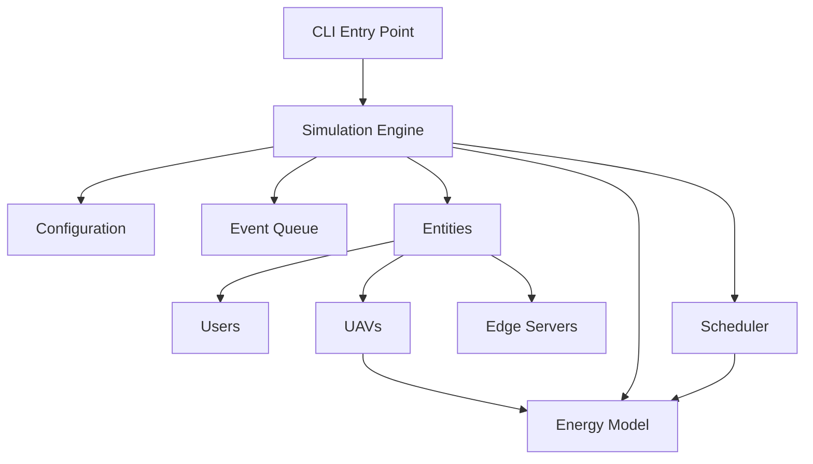
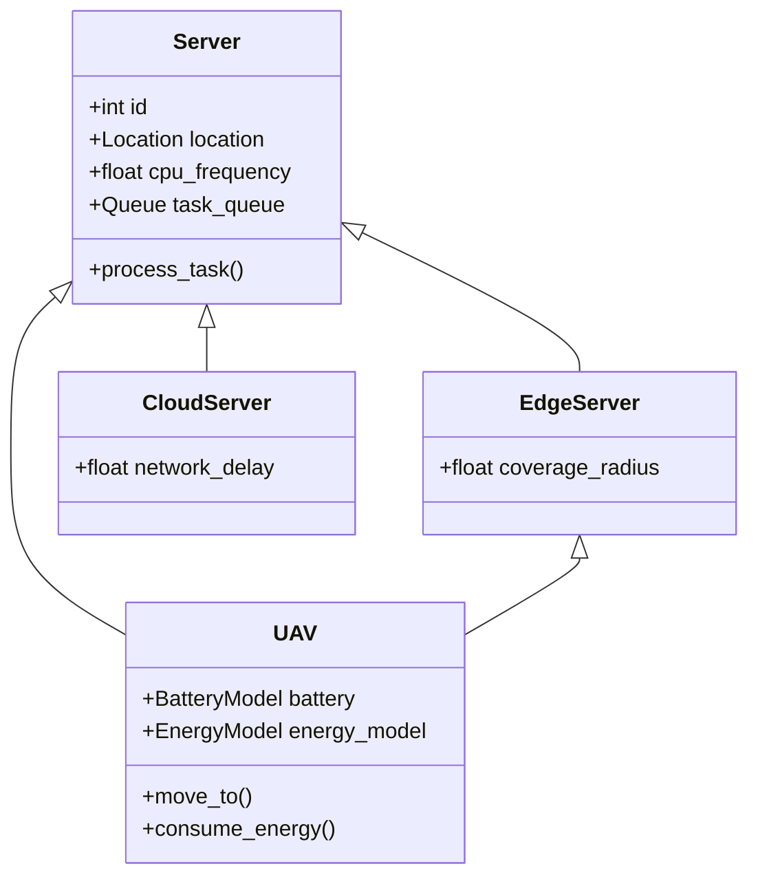
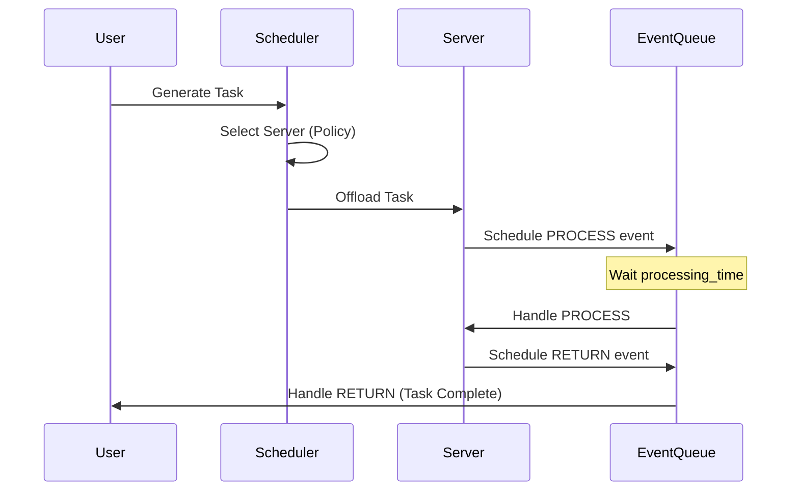

# AirCompSim Architecture Documentation

## 1. System Overview

**AirCompSim** is a discrete event simulator designed for **Energy-Efficient Air Computing**. It simulates a multi-tier computing environment comprising:

1.  **Mobile Users**: Ground-based users generating computational tasks.
2.  **UAVs (Unmanned Aerial Vehicles)**: Aerial edge servers providing compute and relay services.
3.  **Edge Servers**: Fixed ground-based servers with moderate compute power.
4.  **Cloud**: Remote data center with virtually infinite compute capacity but high latency.

The system is built to evaluate **energy-aware scheduling algorithms**, **UAV positioning strategies**, and **DRL (Deep Reinforcement Learning)** agents for dynamic optimization.

---

## 2. High-Level Architecture

The project is structured as a modular Python package `aircompsim`.



### 2.1 Core Modules

| Module | Responsibility | Key Classes |
|--------|----------------|-------------|
| **`aircompsim.core`** | Simulation engine and event loop | `Simulation`, `Event`, `EventQueue` |
| **`aircompsim.entities`** | Physical entities in the system | `User`, `UAV`, `EdgeServer`, `Task` |
| **`aircompsim.energy`** | Energy consumption modeling | `EnergyModel`, `BatteryModel`, `ChargingStation` |
| **`aircompsim.drl`** | Reinforcement learning agents | `DQNAgent`, `ActorCriticAgent`, `ReplayBuffer` |
| **`aircompsim.config`** | Configuration management | `SimulationConfig`, `load_config` |

---

## 3. Core Components

### 3.1 Simulation Engine (`core/simulation.py`)
The `Simulation` class orchestrates the entire lifecycle. It uses a **Discrete Event Simulation (DES)** approach.
- **Initialization**: Sets up users, servers, and UAVs based on config.
- **Event Loop**: Processes events from the priority queue ordered by time.
- **Event Handlers**:
    - `OFFLOAD`: Task generation and server selection.
    - `PROCESS`: Task processing on a server.
    - `RETURNED`: Task completion and result delivery.
    - `UAV_MOVE`: UAV movement updates.
    - `STATE_UPDATE`: Periodic DRL state observation.

### 3.2 Event System (`core/event.py`)
Events drive the simulation.
```python
@dataclass
class Event:
    priority: float      # Processing order
    sim_time: float      # Simulation timestamp
    event_type: EventType
    task: Optional[Task]
    target_id: Optional[int]
```

### 3.3 Energy Model (`energy/models.py`)
Calculates energy consumption for all operations.
- **Flight Energy**: Based on aerodynamics (lift, drag, velocity).
- **Compute Energy**: Based on CPU cycles and frequency (E = κf³t).
- **Communication Energy**: Based on transmission power and bandwidth.

### 3.4 Scheduler (`energy/scheduler.py`)
Decides where to offload tasks.
- **Strategies**:
    - `ENERGY_FIRST`: Minimize total energy (UAV + transmission).
    - `LATENCY_FIRST`: Minimize completion time.
    - `BALANCED`: Weighted sum of energy and latency cost.
    - `DRL_BASED`: Uses trained agent policy.

---

## 4. Entity Hierarchy

The server hierarchy allows polymorphic handling of compute resources.



---

## 5. DRL Integration

The system supports **Deep Reinforcement Learning** for dynamic decision making, particularly for UAV positioning and task offloading.

- **State Space**: Device locations, queue lengths, battery levels.
- **Action Space**:
    - Discrete: Select server index.
    - Continuous: UAV velocity vector (dx, dy).
- **Reward Function**: Combination of task success, latency reduction, and energy savings.

---

## 6. Flow Diagrams

### 6.1 Task Lifecycle



---

## 7. Configuration

Configuration is managed via YAML/JSON files and loaded into strong-typed dataclasses.

```python
@dataclass
class SimulationConfig:
    time_limit: int
    user_count: int
    uav_config: UAVConfig
    edge_config: EdgeConfig
    energy_config: EnergyConfig
```

This ensures type safety and easy experimentation with different parameters.
