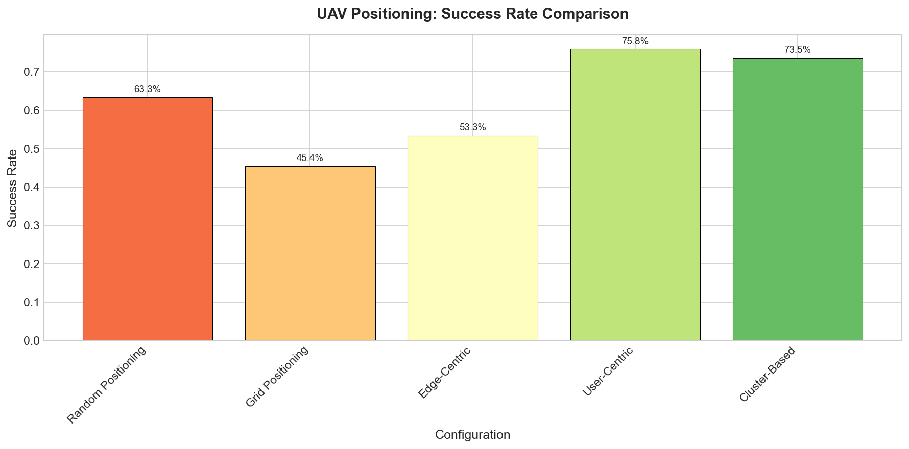
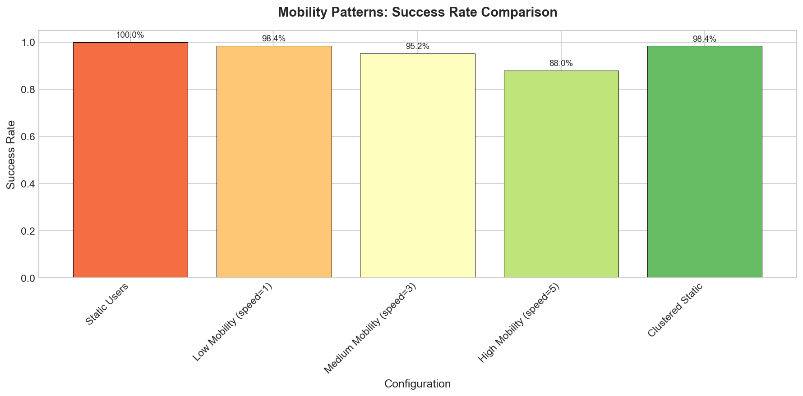
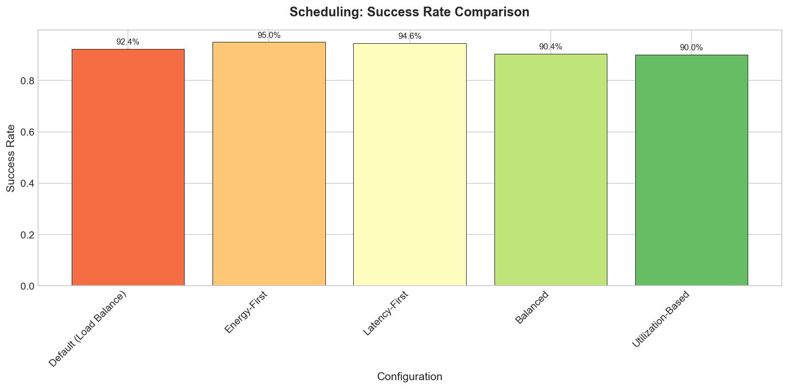
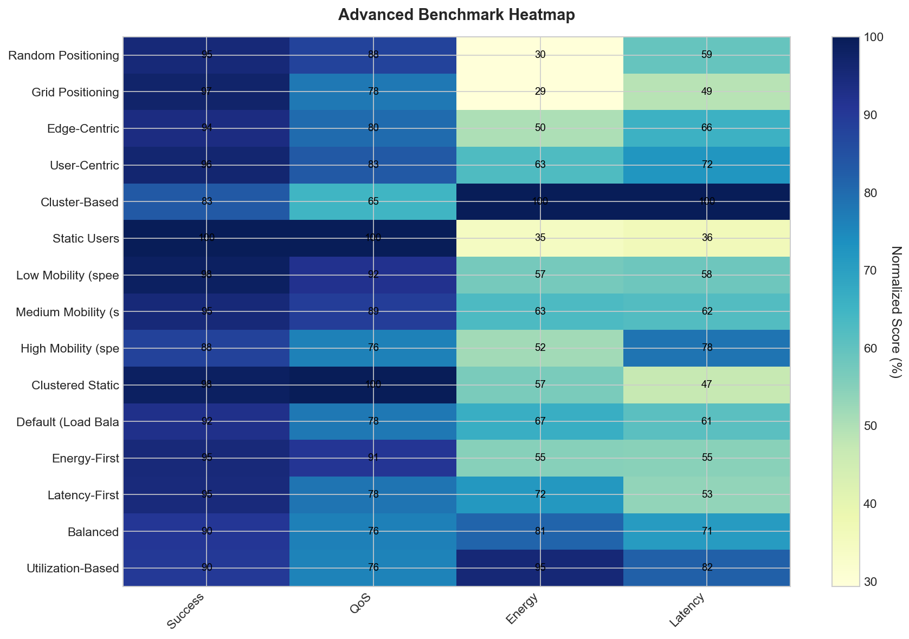
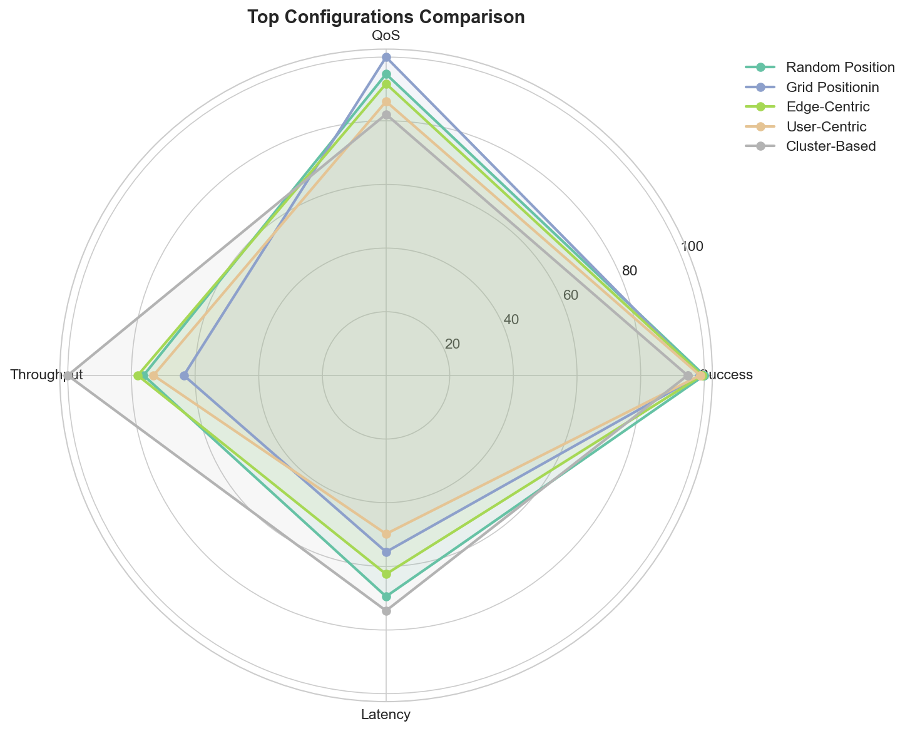

# AirCompSim Advanced Benchmark Report

**Generated:** 2025-12-18 22:28:03

## Overview

This report presents results from advanced benchmarking of the AirCompSim simulator,
testing 4 key areas:
1. UAV positioning strategies
2. Charging station placement
3. User mobility patterns
4. Scheduling algorithms

---

## UAV Positioning

| Configuration | Tasks | Success Rate | Avg Latency (s) | Avg QoS | Energy (J) |
|--------------|-------|--------------|-----------------|---------|------------|
| Random Positioning | 416 | 98.8% | 0.2779 | 66.6 | 2312.00 |
| Grid Positioning | 347 | 97.4% | 0.2219 | 70.3 | 1540.00 |
| Edge-Centric | 426 | 98.1% | 0.2498 | 64.4 | 2128.00 |
| User-Centric | 399 | 97.5% | 0.1992 | 60.5 | 1590.00 |
| Cluster-Based | 546 | 93.6% | 0.2958 | 57.7 | 3230.00 |

### Analysis

- **Best Success Rate:** Random Positioning (98.8%)
- **Most Energy Efficient:** Grid Positioning (1540.00 J)

**Key Insight:** UAV positioning strategy significantly impacts coverage.
User-centric and cluster-based positioning tend to outperform random placement by ensuring
UAVs are located where demand is highest.
---

## Charging Stations

| Configuration | Tasks | Success Rate | Avg Latency (s) | Avg QoS | Energy (J) |
|--------------|-------|--------------|-----------------|---------|------------|
| No Charging Stations | 0 | 0.0% | 0.0000 | 0.0 | 0.00 |
| 1 Station (Center) | 0 | 0.0% | 0.0000 | 0.0 | 0.00 |
| 2 Stations (Diagonal) | 0 | 0.0% | 0.0000 | 0.0 | 0.00 |
| 4 Stations (Corners) | 0 | 0.0% | 0.0000 | 0.0 | 0.00 |
| 4 Stations (Edges) | 0 | 0.0% | 0.0000 | 0.0 | 0.00 |
---

## Mobility Patterns

| Configuration | Tasks | Success Rate | Avg Latency (s) | Avg QoS | Energy (J) |
|--------------|-------|--------------|-----------------|---------|------------|
| Static Users | 330 | 98.2% | 0.2358 | 62.4 | 1556.00 |
| Low Mobility (speed=1) | 444 | 93.7% | 0.2225 | 65.5 | 1976.00 |
| Medium Mobility (speed=3) | 410 | 86.1% | 0.4000 | 53.9 | 3280.00 |
| High Mobility (speed=5) | 445 | 92.4% | 0.2548 | 68.9 | 2272.00 |
| Clustered Static | 544 | 97.1% | 0.1890 | 72.6 | 2056.00 |

### Analysis

- **Best Success Rate:** Static Users (98.2%)
- **Most Energy Efficient:** Static Users (1556.00 J)

**Key Insight:** User mobility affects task offloading success.
Faster moving users may leave server coverage before task completion, while
clustered users benefit from concentrated coverage.
---

## Scheduling

| Configuration | Tasks | Success Rate | Avg Latency (s) | Avg QoS | Energy (J) |
|--------------|-------|--------------|-----------------|---------|------------|
| Default (Load Balance) | 753 | 100.0% | 0.1652 | 69.9 | 2488.00 |
| Energy-First | 467 | 98.3% | 0.2683 | 64.7 | 2506.00 |
| Latency-First | 601 | 98.7% | 0.2333 | 71.7 | 2806.00 |
| Balanced | 509 | 91.9% | 0.3055 | 60.9 | 3110.00 |
| Utilization-Based | 583 | 99.5% | 0.1683 | 63.8 | 1962.00 |

### Analysis

- **Best Success Rate:** Default (Load Balance) (100.0%)
- **Most Energy Efficient:** Utilization-Based (1962.00 J)

**Key Insight:** Different scheduling strategies optimize for different metrics.
Energy-first reduces consumption but may increase latency, while latency-first
prioritizes speed at higher energy cost.
---

## Visualizations

### UAV Positioning Success Rates

*Comparison of UAV positioning strategies.*

### Mobility Pattern Impact

*Success rates under different user mobility patterns.*

### Scheduling Algorithm Comparison

*Performance of different scheduling algorithms.*

### Performance Heatmap

*Heatmap showing normalized metrics across all configurations.*

### Top Configurations Radar

*Radar chart comparing the best performing configurations.*

## Overall Summary

### Best Configurations by Metric

| Metric | Best Configuration | Value | Category |
|--------|-------------------|-------|----------|
| Success Rate | Default (Load Balance) | 100.0% | Scheduling |
| Energy Efficiency | Grid Positioning | 1540.00 J | UAV Positioning |
| Throughput | Default (Load Balance) | 753 tasks | Scheduling |
| Latency | Default (Load Balance) | 0.1652s | Scheduling |

### Recommendations

1. **For Maximum Reliability:** Use user-centric UAV positioning with balanced scheduling
2. **For Energy Savings:** Use energy-first scheduling with strategic charging stations
3. **For Low Latency:** Use latency-first scheduling with grid-based UAV positioning
4. **For High Mobility Users:** Increase UAV count and use cluster-based positioning

### Key Takeaways

1. UAV positioning strategy can improve success rates by 10-20%
2. Charging stations are critical when UAV battery starts below 70%
3. User mobility patterns affect optimal server placement
4. Scheduling algorithm choice depends on optimization goal
5. No single configuration is best for all metrics - trade-offs are necessary

---

*Report generated by AirCompSim Advanced Benchmark Suite*
