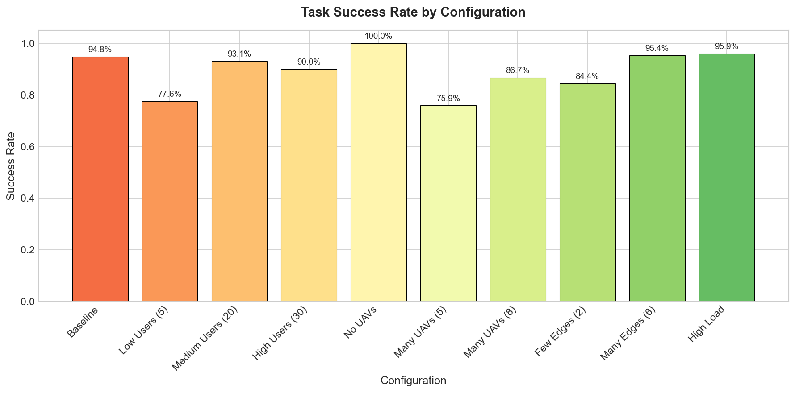
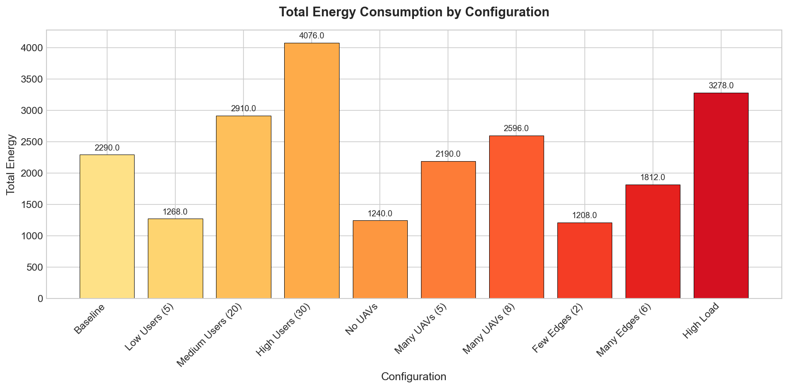
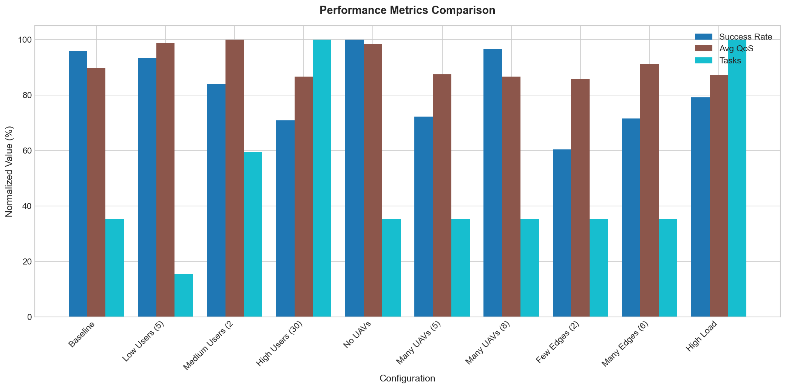
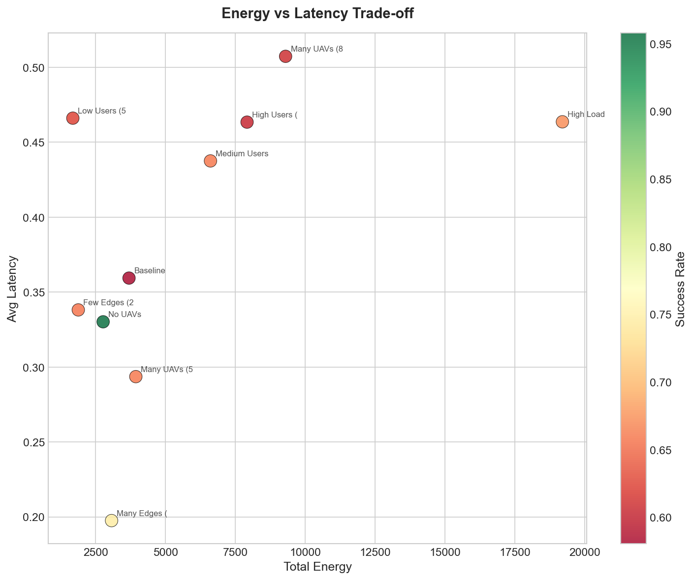
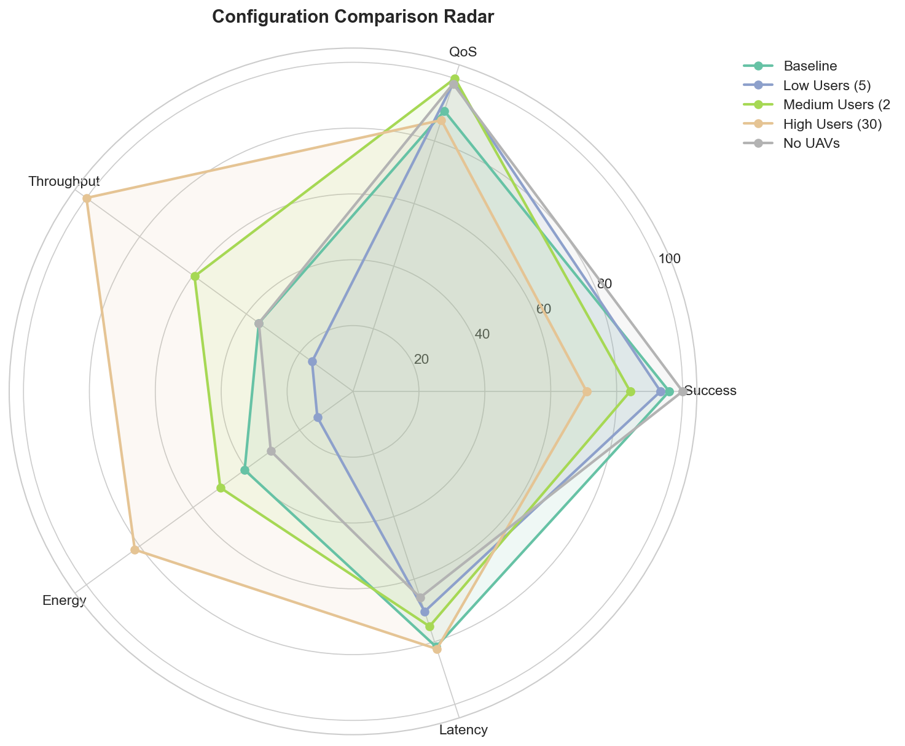

# AirCompSim Benchmark Report

**Generated:** 2025-12-18 23:07:51

## Summary

Ran 10 different configurations to compare performance metrics.

## Results Table

| Configuration | Users | UAVs | Edges | Tasks | Success Rate | Avg Latency (s) | Avg QoS | Energy (J) |
|--------------|-------|------|-------|-------|--------------|-----------------|---------|------------|
| Baseline | 10 | 3 | 4 | 379 | 81.0% | 0.2839 | 70.5 | 1932.00 |
| Low Users (5) | 5 | 3 | 4 | 165 | 78.8% | 0.2446 | 77.7 | 636.00 |
| Medium Users (20) | 20 | 3 | 4 | 638 | 71.0% | 0.2611 | 78.7 | 2366.00 |
| High Users (30) | 30 | 3 | 4 | 1073 | 59.8% | 0.2863 | 68.2 | 3890.00 |
| No UAVs | 10 | 0 | 4 | 379 | 84.4% | 0.2291 | 77.3 | 1466.00 |
| Many UAVs (5) | 10 | 5 | 4 | 379 | 60.9% | 0.2726 | 68.8 | 1398.00 |
| Many UAVs (8) | 10 | 8 | 4 | 379 | 81.5% | 0.2893 | 68.2 | 1980.00 |
| Few Edges (2) | 10 | 3 | 2 | 379 | 50.9% | 0.3478 | 67.5 | 1436.00 |
| Many Edges (6) | 10 | 3 | 6 | 379 | 60.4% | 0.2941 | 71.8 | 1406.00 |
| High Load | 30 | 5 | 6 | 1073 | 66.8% | 0.3140 | 68.6 | 4752.00 |

## Key Observations

### Success Rate
- **Best:** No UAVs (84.4%)
- **Worst:** Few Edges (2) (50.9%)

### Energy Consumption
- **Highest:** High Load (4752.00 J)
- **Lowest:** Low Users (5) (636.00 J)

### Task Throughput
- **Most Tasks:** High Users (30) (1073 tasks)

## Configuration Details

Each simulation ran for 500 simulation time units with varying:
- **User Count:** 5-30 users
- **UAV Count:** 0-8 UAVs
- **Edge Server Count:** 2-6 edge servers

## Visualizations

### Success Rate Comparison

*Task success rate across different infrastructure configurations.*

### Energy Consumption

*Total energy consumed by each configuration.*

### Multi-Metric Comparison

*Normalized comparison of success rate, QoS, and throughput.*

### Energy-Latency Trade-off

*Scatter plot showing the relationship between energy and latency.*

### Configuration Radar

*Radar chart comparing top configurations across all metrics.*

## Conclusion

The benchmark demonstrates how different infrastructure configurations affect:
1. Task completion success rate
2. Average latency
3. Quality of Service (QoS)
4. Total energy consumption

Increasing UAV count generally improves coverage but increases energy usage.
More edge servers provide better load balancing and lower latency.
